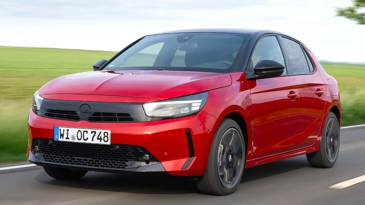

# License Plate Recognition

This project is a **license plate recognition program** using **OpenCV** and **pytesseract**.  
It can detect and read vehicle license plates from both **images** and **videos**.

## Versions

- **Image version:** process a single image to detect license plates.  
- **Video version:** process a video file and detect license plates frame by frame.

## Gallery

| Original | Processed |
|----------|-----------|
|  | .jpg) |
|  | .jpeg) |
|  | .jpg) |